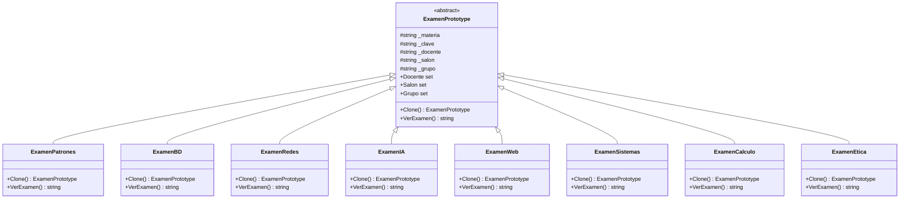

# Diagrama UML - Patrón Prototype

```mermaid
classDiagram

class ExamenPrototype{
    <<abstract>>
    #string _materia
    #string _clave
    #string _docente
    #string _salon
    #string _grupo
    +Docente set
    +Salon set
    +Grupo set
    +Clone() ExamenPrototype
    +VerExamen() string
}

class ExamenPatrones{
    +Clone() ExamenPrototype
    +VerExamen() string
}

class ExamenBD{
    +Clone() ExamenPrototype
    +VerExamen() string
}

class ExamenRedes{
    +Clone() ExamenPrototype
    +VerExamen() string
}

class ExamenIA{
    +Clone() ExamenPrototype
    +VerExamen() string
}

class ExamenWeb{
    +Clone() ExamenPrototype
    +VerExamen() string
}

class ExamenSistemas{
    +Clone() ExamenPrototype
    +VerExamen() string
}

class ExamenCalculo{
    +Clone() ExamenPrototype
    +VerExamen() string
}

class ExamenEtica{
    +Clone() ExamenPrototype
    +VerExamen() string
}

ExamenPrototype <|-- ExamenPatrones
ExamenPrototype <|-- ExamenBD
ExamenPrototype <|-- ExamenRedes
ExamenPrototype <|-- ExamenIA
ExamenPrototype <|-- ExamenWeb
ExamenPrototype <|-- ExamenSistemas
ExamenPrototype <|-- ExamenCalculo
ExamenPrototype <|-- ExamenEtica
```
